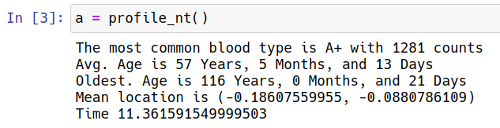
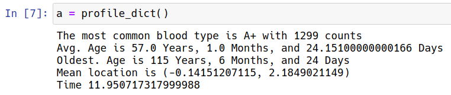
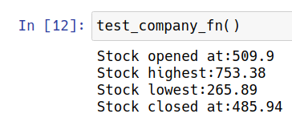

# P3A9 - Session 9 Readme file.

### Only the major code segments are shown


## Q1. Use the Faker library to get 10000 random profiles. Using namedtuple, calculate the largest blood type, mean-current_location, oldest_person_age, and average age (add proper doc-strings)


First, we create a named tuple called 'profile'

```python
profile = namedtuple('profile', ['job', 'company', 'ssn', 'residence', 'current_location',
                        'blood_group', 'website', 'username', 'name', 'sex', 'address', 'mail', 'birthdate'])
profile.__doc__ = 'Fake personnel profile using faker library'
```

The profiles are generated using the `Faker` library

```python
cnt = 10000
for c in range(cnt):
	globals()['profile' + str(c)] = profile(**fake.profile())
```

Note the use of the argument `globals()['profile' + str(c)]` on the LHS. This dynamically generates new variables on each iteration of the for loop (profile0, profile1, ...) thus giving us control on how many profiles are created.

Another loop is then used to extract values such as blooc count, age, location etc. A little processing is done to get the age from date of birth, find the minimum date of birth (and hence the maximum age) and the average of the location.

```python
for c in range(cnt):
	blood_count.update([(globals()['profile' + str(c)]).blood_group])
	lat += (globals()['profile' + str(c)]).current_location[0]
	lng += (globals()['profile' + str(c)]).current_location[1]
	mindob = min(mindob, (globals()['profile' + str(c)]).birthdate)
	sumdob += today - (globals()['profile' + str(c)]).birthdate
```

Finally, it prints the elapsed time before returning the quantities mentioned in the assignment




## Q2. Do the same thing above using a dictionary. Prove that namedtuple is faster.


The steps are similar to that in question 1. Major difference is that the profiles are stored in dictionaries.

```python
cnt = 10000
for c in range(cnt):
        globals()['profile' + str(c)] = fake.profile()
```



**We do see that the dictionary approach often (but not always!) takes slightly longer time to execute.**


## Q3. Create fake data (you can use Faker for company names) for imaginary stock exchange for top 100 companies (name, symbol, open, high, close). Assign a random weight to all the companies. Calculate and show what value the stock market started at, what was the highest value during the day, and where did it end. Make sure your open, high, close are not totally random. You can only use namedtuple.

First, we create a named tuple called 'company'

```python
company = namedtuple(
        'company', ['name', 'symbol', 'open', 'high', 'low', 'close'])
company.__doc__ = "Company stock profile with current market trend values"library'
```

The name is generated using Faker, but other values such as stock open and fluctuations are generated usign random numbers

```python
cnt = 100
for c in range(cnt):
	comp_name = fake.company()
	comp_symb = comp_name
	open = random.randint(80, 950)
	fluctuations = [open * random.uniform(0.5, 1.5) for _ in range(48)]
	close = fluctuations[-1]
	high = max(fluctuations)
	low = min(fluctuations)
	globals()['company' + str(c)] = company(comp_name,
											comp_symb, open, high, low, close)
```

A little processing is done to get the Stock Exchange's open/close values. Finally, it returns the quantities mentioned in the assignment


